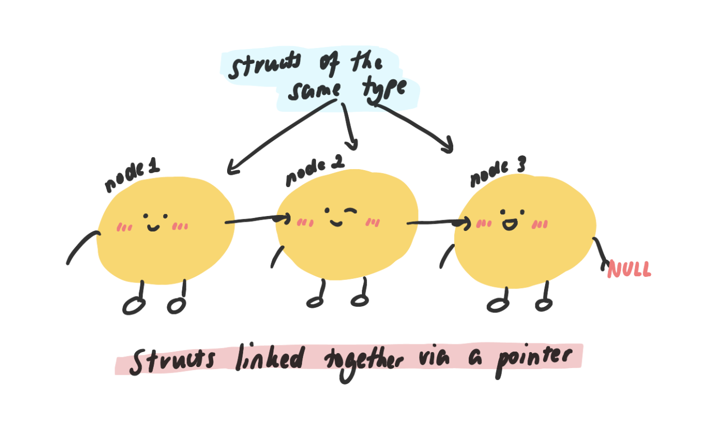

# Week 08

### 💕 Checking in

---

Have you read/get started on Assignment 2?

Do you have any questions about Assignment 2?

### ⚙️ Part 1: Malloc revision

---

What does `malloc` do?

- Allocates memory

Why do we use `malloc`?

- `malloc` allows a variable to last longer than the life-cycle of its function

What parameter does `malloc` take in?

- Size of the block of memory you want to make (bytes)
- `sizeof()` is often used with `malloc`

What does `malloc` return and how can it be used?

- The address of that block of memory
- Create a suitable pointer to store the address

********`malloc` `char`, `int` and `int` array:**

```c
// Malloc a char
char *char_ptr = malloc(sizeof(char));

// Malloc an int
int *int_ptr = malloc(sizeof(int));

// Malloc an int array (SIZE = 10);
int *int_array_ptr = malloc(sizeof(int) * SIZE);

// Malloc a double array (SIZE = 10);
double *double_array_ptr = malloc(sizeof(double) * SIZE);
```

**`malloc` a struct:**

```c
struct node {
	int data;
	struct node *next;
};
```

How do we `malloc` a `struct node`?

```c
struct node *new_node = malloc(sizeof(struct node));
```

Initialise the fields to a reasonable default value.

```c
// (*new_node).data = 0;
new_node->data = 0;
new_node->next = NULL;
```

How can we move this code to a function?

```c
int main(void) {
	struct node *new_node = create_node(5);
	return 0;
}

struct node *create_node(int value) {
	struct node *new_node = malloc(sizeof(struct node));
	new_node->data = value;
	new_node->next = NULL;
	return new_node;
}
```

### 🔗 ****Part 2: Diagramming Linked Lists****

---



**Why are linked lists useful?**

- Inserting at the start, or in the middle.
- Deleting from anywhere in the list.
- Don't need to know a size at the start.

**Tips for working with linked lists:**

- Drawing out a linked list really helps with visualising what is happening.

**Basis of a linked list:**

```c
struct node {
  int data;
  struct node *next;
};
```


- Head pointer stores the address the of the first struct node, as seen by the arrows and address numbers. (These addresses are just made up numbers, for demonstration purposes)
- `head->next` (`(*head).next`) is a pointer, and `NULL` means that this is the last node in the list.
- Represents a single node OR linked list of length 1.

How can we modify the data in the node so it becomes `5`?

```c
head->data = 5;
```

How can we add another node after the one in the diagram?

```c
struct node *new_node_1 = malloc(sizeof(struct node));
new_node_1->data = 0;
new_node_1->next = NULL;
head->next = new_node_1;

struct node *new_node_2 = malloc(sizeof(struct node));
new_node_2->data = 0;
new_node_2->next = NULL;
head->next->next = new_node_2;
```

**Iteration through a linked list:**


- Many nodes linked together via `next` fields.
- The `head` pointer still stores the address of the first node, and the last node's `next` field still points to `NULL`.
- A second pointer, `current`, that has the same value as `head`, meaning that it ALSO points to the start of the linked list.
- Note: we can only directly access the head of the linked list, so we'll have to iterate through the list to access the other nodes.
    
    
❓ Why do we need a `current` pointer?

Because we don't want to use the `head` pointer to loop through the linked list since the it should always be referencing the head of the list. If we move the `head` pointer incorrectly, we would lose the head of the list.
    
❓ How do we move the `current` pointer to the next node in the list?
    
```c
current = current->next;
```

**********************Code for iterating through a linked list:**********************

```c
// A program to demonstrate how looping through a linked list works
// Angella Pham (z5361210)

#include <stdio.h>
#include <stdlib.h>

struct node {
    int data;
    struct node *next;
};

struct node *create_node(int data);
struct node *add_node_at_tail(struct node *head, int data);

int main(void) {

    struct node *head = NULL;
    head = add_node_at_tail(head, 1);
    head = add_node_at_tail(head, 2);
    head = add_node_at_tail(head, 3);
    head = add_node_at_tail(head, 4);
    head = add_node_at_tail(head, 5);
		// 1 -> 2 -> 3 -> 4 -> 5 -> NULL

    // TODO: write a loop to iterate through the linked list and print
    // the data at each node
		struct node *curr = head;
		while (curr != NULL) {
			printf("%d -> ", curr->data);
			curr = curr->next;
		}
		printf("NULL\n");

    return 0;
}

struct node *create_node(int data) {
    struct node *new_node = malloc(sizeof(struct node));
    new_node->data = data;
    new_node->next = NULL;
    return new_node;
}

struct node *add_node_at_tail(struct node *head, int data) {
    struct node *new_node = create_node(data);

		if (head == NULL) {
			return new_node;
		}

    struct node *current = head;
    while (current->next != NULL) {
        current = current->next;
    }
    current->next = new_node;

    return head;
}
```


❓ How can we modify the above code to stop at the last node in the linked list?

```c
struct node *curr = head;
while (curr->next != NULL) {
	curr = curr->next;
}
```

### ➕ ****Part 3: Inserting into a linked list****

---

We will write a program where we have to insert a new node into the `n`th index in a list.

We have diagrams to help us consider the different cases of insertion:

1. An empty list:
    
    
    
2. A list of length 1:
    
    
    
3. A longer list:
    
    
    

There are a few edge cases we have to consider:

- `n = 0`, and the list is any length (Diagram 1, 2 or 3).
- `n` is greater than the length of the linked list.
- `n` is any value, and the list is empty (Diagram 1).
- `n` is less than the length of the list, and the list is not empty (Diagram 2, 3).