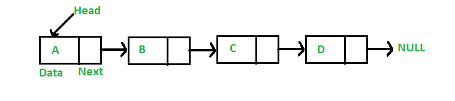

# Week 09

### 💕 **Part 0: Assignment 2**

---

What are you up to in the assignment?

Tips:

- Work on it every day (even for a little bit) if possible.
- Make sure you understand basic linked list operations (look at week 08 problem set):
    - Printing, inserting at head, inserting at tail etc…
- Break your code into functions as you go along, to make your code more readable and easier to debug.
- Go to the help sessions or ask for help on the forum. Don’t just sit there when you are stuck! Persevere! 😤

### 🆓 **Part 1: Free**

---

**Why is `free()` important?**

- Memory is a finite resource within your running program.
- In very short running simple programs, failing to free memory won't have a noticeable effect.
- However, on long running programs, failing to free memory means you will be consuming a finite resource without replenishing it. Eventually, memory will run out and your program will crash.

**Example:** Google Chrome, when runs for a long period of time, can get laggy and even crashes since the program allocates a lot of memory but don’t free them correspondingly.

**Examples of not freeing properly:** 

1. **Memory leak:**
    
    
    
    Incorrect code:
    
    ```c
    struct node *delete_head(struct node *head) {
    	head = head->next;
    	return head;
    }
    ```
    
    
    
    Correct code:
    
    ```c
    struct node *delete_head(struct node *head) {
    	struct node *old_head = head;
    	head = head->next;
    	free(old_head);
    	return head;
    }
    
    struct node *delete_head(struct node *head) {
    	struct node *next_head = head->next;
    	free(head);
    	return next_head;
    }
    ```
    
    
    
2. **Use after free:**
    
    
    
    Incorrect code:
    
    ```c
    void delete_node(struct node *head, struct node *target) {
    	struct node *curr = head;
    	while (curr != NULL) {
    		if (curr->next != NULL && curr->next == target) {
    			free(target);
    			return;
    		}
    		curr = curr->next;
    	}
    }
    ```
    
    
    
    Correct code:
    
    ```c
    void delete_node(struct node *head, struct node *target) {
    	struct node *curr = head;
    	while (curr != NULL) {
    		if (curr->next != NULL && curr->next == target) {
    			curr->next = curr->next->next;
    			free(target);
    		}
    		curr = curr->next;
    	}
    }
    ```
    
    
    

**Notes:**

- When freeing something, you will need to have a pointer pointing to it, then call free on that pointer.
- When we want to free a whole linked list, is freeing the head of the linked list enough?

### 🔗 **Part 2: Linked List Exercises**

---

We have to implement two functions `copy()` and `list_append()`:

The `copy()` function will take in the head of the original list you want to copy, then create a new list that has the same values as the original list and then return that new list. It will also free the original list.

The `list_append()` function will take in the heads of two lists that you want to join together, then create a new list that has the same values as the original two lists and then return that new list.

**Steps:**

- Draw a diagram of what things will look like, before and after
- Identify how many things will need to be malloc’ed or free’d
- Plan out steps for what will need to happen in the functions
- List any special cases
- Write down a plan to implement the functions
